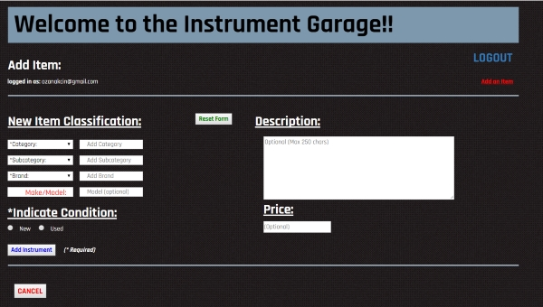

# Instrument Garage


>A self-contained LAMP-style web application meant to demonstrate common CRUD  
(create/read/update/delete) operations as performed by many deployed services.  
The application is for a store listing new and used musical instruments  
members have to trade with one another.  PostgreSQL and Python replace  
the MySQL and PHP components of the traditional LAMP stack in this app.  

&nbsp;  
&nbsp;  


&nbsp;  

#### Key Features:  

>1). *PostgreSQL Database* - enforces a canonical data model via entity  
    mappings to ensure data-integrity.  This is applied every step  
    of the way with categorization rules enforced from the addition of  
    new items to the database to their modification.  

>2). *OAuth2.0* - incorporates Google sign in based authentication based  
    on the OAuth2.0 standard for registration and log-ins.  

>3). *Permissioning* - enforces user/owner permissioning so that only  
    posters of items may update/delete entries (with similar  
    similar logic applied towards purchase functionality).  

>4). *Sample Data Provided* - comes with dedicated modules to seed  
    a freshly initialized database.

&nbsp;  




 ## Setup & Installation  

### Pre-requisites

The application is Python 2.7\*-based and therefore so are its dependencies.  
A requirements file, *requirements.txt*, is provided to facilitate  
installation.  Note also that PostgreSQL must be installed in an environment  
where the Python psycopg2 adapter will have access to it.  

Instructions below assume installation in a Python virtual environment using  
the convenient pip installer.  

These utilities may be installed as follows (on Ubuntu):

```
sudo apt-get install virtualenv
sudo apt-get install python-pip
```
*(Installation will vary with your Linux distribution).*  

Because this application makes use of the OAuth2.0 Google-based sign-in  
authentication protocol, a *client_secrets.json* file is required.  
You can read more about this file and how to obtain one [here](https://developers.google.com/api-client-library/python/guide/aaa_client_secrets).  

With the project cloned, obtain a valid client_secrets.json file and  
save it to a location in the project directory.  Replace all references  
to the client_secrets.json file in the catalog.py script with the full path  
of the valid client_secrets file:  

```
CLIENT_ID = json.loads(
    open('/path/to/valid/client_secrets.json', 'r').read())['web']['client_id']
    ...
```

### Installation

To install the application and its dependencies in a Python virtual environment,  
navigate to the project directory.  Create the virtual environment as follows:

```
virtualenv venv
```
*(Substitute whatever name you wish to call the virtual environment for 'venv').*  

Once the virtual environment has been created, activate it as follows:

```
source venv/bin/activate
```

You should see a corresponding change in the prompt at the command line like so:  

```
(venv) $
```

Install the application and all its dependencies as follows:

```
pip install -r requirements.txt
```
*(Note: super user/admin permissions may be required in which case you can  
prefix this with 'sudo' on Ubuntu distributions).*  

Next, create the PostgreSQL database as follows:

```
python create_db.py
```

To pre-seed the database with sample data, run the following command:

```
python populate_db.py
```

This application makes use of the Flask framework.  As such, it can be run  
as a standalone as follows:

```
python catalog.py
```

which will application to localhost on port 5000, by default.  

Instructions on site usage may be found [here](./siteUsage.md).

Detailed background information on the original incarnation of this project,  
including instructions on how to run it in a more production-like environment  
using the Apache web server may be found [here](https://github.com/builderLabs/postgresql_catalog_webapp/blob/master/CatalogCfg.md).

